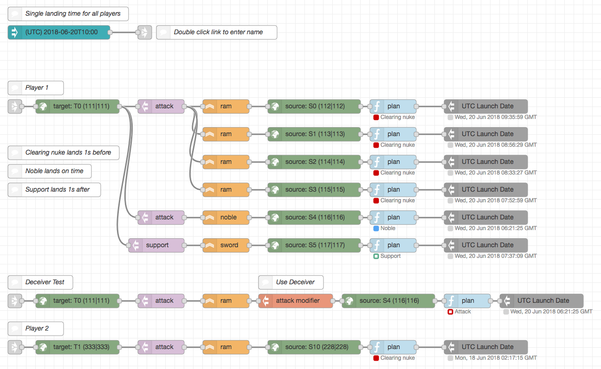
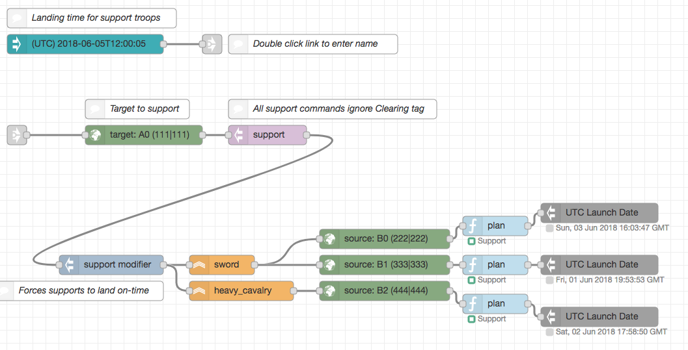

# Tribal Wars 2 - Graphical Attack Planner

A visual tool for wiring commands for Tribal Wars 2, runs on Node-RED. Short-named tw2-gap, it is a collection of nodes built specifically for the purpose of organizing attack and support commands for the game.

## Demo screenshots





## License

The following license applies to the custom nodes in this repository.

```
Copyright 2018-2019 Cong Nguyen

Licensed under the Apache License, Version 2.0 (the "License"); you may not use this file except in compliance with the License. You may obtain a copy of the License at

http://www.apache.org/licenses/LICENSE-2.0
Unless required by applicable law or agreed to in writing, software distributed under the License is distributed on an "AS IS" BASIS, WITHOUT WARRANTIES OR CONDITIONS OF ANY KIND, either express or implied. See the License for the specific language governing permissions and limitations under the License.
```